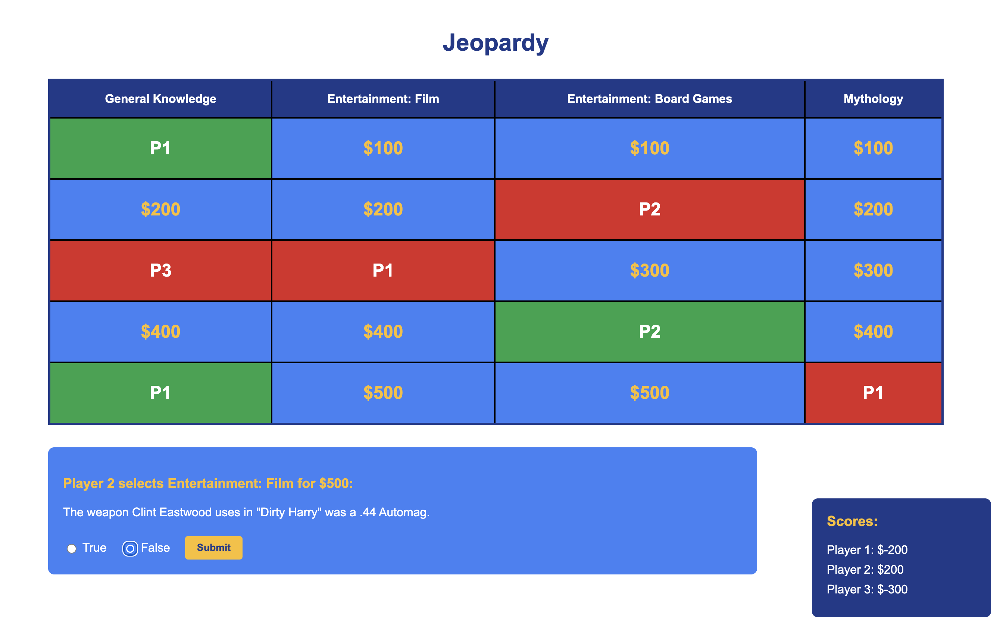
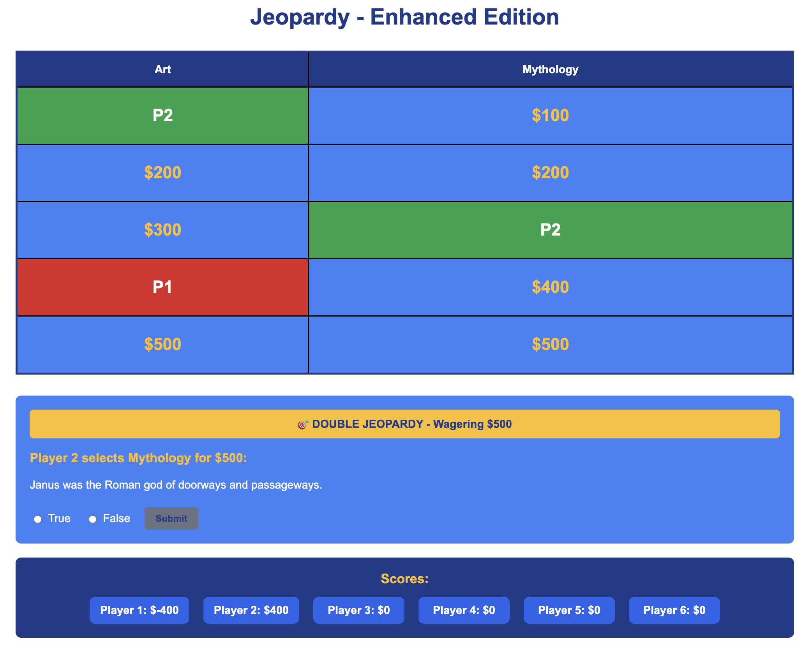
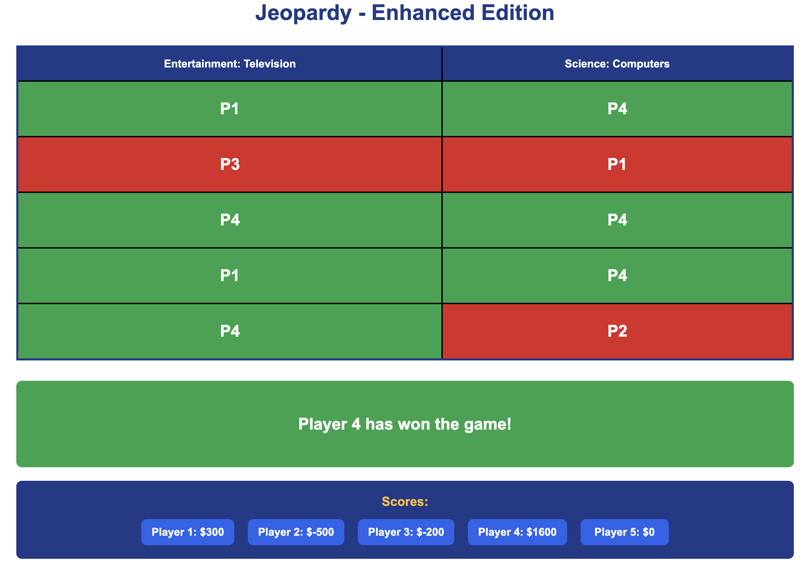

## File Structure

```

labfetch_act1_vkamani1.vue // Activity 1 submission
labfetch_act2_vkamani1.vue // Activity 2 submission
README.md // This documentation
```

## Acitivity 1



### Acitivity 2 - Double jeopardy feature





### References

Open Trivia Database API Documentation
Available at: https://opentdb.com/api_config.php

Available at: https://vuejs.org/guide/introduction.html

Web-based Programming Client API Access Lab document

MDN Web Docs: https://developer.mozilla.org/en-US/docs/Web/API/HTMLElement

MDN Web Docs: https://developer.mozilla.org/en-US/docs/Web/JavaScript/Reference/Statements/async_function

CSS-Tricks: https://css-tricks.com/snippets/css/complete-guide-grid/
